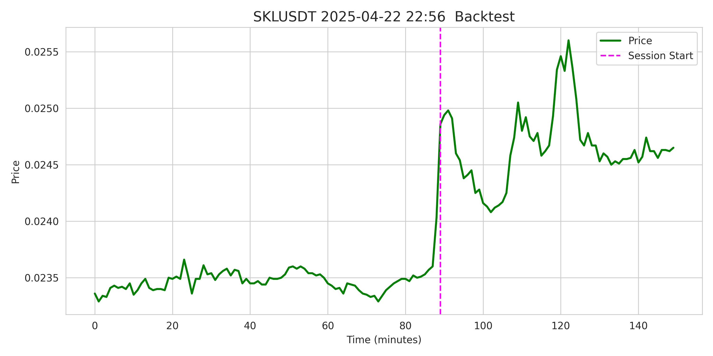

# 🧠 Open RL Trading Agent for Binance Futures

A high-performance, research-grade reinforcement learning system for intraday trading on Binance Futures. Built using Dueling Double Deep Q-Networks (D3QN) and Prioritized Experience Replay (PER), this framework supports realistic backtesting, robust benchmarking, and scalable experimentation.

> ⚠️ **Note**: This release runs in demo mode with a lightweight ~256K-parameter model, short 10-minute sessions, and 30-minute input context — optimized for fast execution, CPU-only training, and interpretable visualizations. The full architecture (60-min sessions, 90-min context, 1M+ parameters) is still dormant. This project lays the foundation for a scalable, production-grade trading AI.

---

## 📌 Overview

📖 Read the full technical article (English):  
[RL Agent for Algorithmic Trading on Binance Futures — Architecture, Backtest, and Results](https://medium.com/@YuriKolesnikovAI/rl-agent-for-algorithmic-trading-on-binance-futures-architecture-backtest-and-results-63fc4662893d)

📖 Article (Russian):  
[RL-агент для алгоритмической торговли на Binance Futures: архитектура, бэктест, результаты](https://habr.com/ru/articles/934258/)

This repository includes:

* ✅ A modular RL pipeline for market simulation and policy learning
* ✅ A custom Gym-compatible environment with slippage, commissions, and penalties
* ✅ A D3QN agent with PER buffer, epsilon decay, and action masking
* ✅ A complete lifecycle: training, testing, backtesting, and baseline evaluation
* ✅ An honest CNN classifier as a supervised baseline
* ✅ Config-driven experiment isolation and reproducibility

---

## 🧠 Agent Architecture

| Component       | Description                                                                                                       |
| --------------- | ----------------------------------------------------------------------------------------------------------------- |
| **Environment** | `TradingEnvironment`: simulates real-time market conditions with commissions, slippage, and partial observability |
| **Model**       | CNN encoder with a dueling Q-head (Value + Advantage streams)                                                     |
| **Agent**       | D3QN with epsilon-greedy exploration, PER sampling, target sync, and gradient clipping                            |
| **Baseline**    | CNN classifier trained in supervised mode using the same architecture                                             |
| **Backtester**  | Realistic simulation engine with signal tracking, execution filtering, and Optuna-powered config tuning           |

---

## 📈 Backtest Balance Curve

A full equity curve over the backtest period (March–June 2025):


---

## 📈 Performance Summary

### 🔹 RL Agent (Test Set)

* **Mean Reward**: 0.00285
* **Mean PnL**: +28.47 USDT
* **Win Rate**: 55.67%

### 🔹 Backtest (Realistic Simulation)

* **Final Balance Change**: +144.23%
* **Sharpe Ratio**: 1.85
* **Sortino Ratio**: 2.05
* **Accuracy**: 69.6%
* **Profit Days**: 78.57%
* **Max Drawdown**: –22.49%
* **Average Trade Size**: 11,324.29 USDT
* **Trades per Day**: 2.00

### 🔹 Baseline (CNN Classifier)

* **Mean PnL**: –27.95 USDT
* **Win Rate**: 47.85%

---

## 🧪 Dataset

A curated minute-level dataset from Binance Futures focused on high-volatility segments. Packaged in `.npz` format.

Each session contains 60 minutes of market activity and serves as a standalone trading window.


| Split      | Period                  | Sessions | Purpose              |
| ---------- | ----------------------- | -------- | -------------------- |
| Train      | 2020-01-14 → 2024-08-31 | 24,104   | RL training          |
| Validation | 2024-09-01 → 2024-12-01 | 1,377    | Model selection      |
| Test       | 2024-12-01 → 2025-03-01 | 3,400    | Final evaluation     |
| Backtest   | 2025-03-01 → 2025-06-01 | 3,186    | Realistic simulation |

📂 Dataset: [HuggingFace Hub](https://huggingface.co/datasets/ResearchRL/open-rl-trading-binance-dataset)

---

## 🚀 Quickstart

```bash
# 1. Train the RL agent
python train.py configs/alpha.py

# 2. Evaluate on the test set
python test_agent.py configs/alpha.py

# 3. Run realistic backtest
python backtest_engine.py configs/alpha.py

# 4. Train supervised CNN baseline
python baseline_cnn_classifier.py configs/alpha_baseline_cnn.py

# 5. Run Optuna config optimization
python optimize_cfg.py configs/alpha.py --trials 100 --jobs 1
```

---

## 📂 Project Structure

```
rl_trading_binance/
├── train.py               # RL training
├── test_agent.py          # Agent evaluation
├── backtest_engine.py     # Full backtest simulation
├── optimize_cfg.py        # Optuna config tuning
├── baseline_cnn_classifier.py
├── config.py              # Config model
├── configs/               # Experiment configs
├── model.py               # CNN + Dueling Q-network
├── agent.py               # D3QN logic
├── replay_buffer.py       # Prioritized replay buffer
├── trading_environment.py # Gym-compatible environment
├── utils.py               # Logging, visualization, metrics
├── data/                  # Market datasets (.npz format)
│   ├── train_data.npz
│   ├── val_data.npz
│   ├── test_data.npz
│   └── backtest_data.npz
├── output/                # Experiment results
│   └── <config_name>/
│       ├── logs/
│       ├── plots/
│       └── saved_models/
```

---

## 📊 Visual Examples

| Profitable Session                  | Unprofitable Session                  |
| ----------------------------------- | ------------------------------------- |
|  |  |
|  |  |

| Train Example                                         | Val Example                                           | Test Example                                          | Backtest Example                                         |
| ----------------------------------------------------- | ----------------------------------------------------- | ----------------------------------------------------- | -------------------------------------------------------- |
|  |  |  |  |

---

## 📣 Live Agent (Telegram Bot)

A more advanced version of this agent is deployed live, scanning Binance Futures in real-time and publishing trade decisions:

* Scans all symbols every minute
* Detects volatility spikes
* Predicts trade direction and confidence
* Publishes signal + final trade outcome with PnL

This is a public demonstration of production-oriented RL decision-making in streaming environments.

👉 Follow: [@binance\_ai\_agent](https://t.me/binance_ai_agent)

| Live Signal + Prediction              | Verification Example             |
| ------------------------------------- | -------------------------------- |
|  |  |

> ⚠️ This system is experimental and for educational purposes only.

---

## 🎯 Demo vs Full Pipeline

| Feature          | Demo Mode (This Repo) | Full System (Production Scope)     |
| ---------------- | --------------------- | ---------------------------------- |
| Session Length   | 10 minutes            | 60 minutes                         |
| Input Context    | 30 minutes            | 90+ minutes                        |
| Model Size       | \~256K parameters     | 1M+ (Transformer-based)            |
| Hardware         | CPU-only              | GPU/TPU-accelerated                |
| Execution Engine | Backtesting only      | Live order execution (Binance API) |
| Data Stream      | Static `.npz`         | Real-time WebSocket + DB           |

---

## 🧭 Roadmap

- [ ] Replace CNN with iTransformer / Perceiver IO / Temporal Fusion Transformer (TFT)
- [ ] Integrate Model-Based RL (Dreamer, MuZero)
- [ ] Extend agent architectures: A3C / PPO / SAC / DDPG / TD3
- [ ] Real-time trade execution via Binance REST & WebSocket API
- [ ] Implement adaptive action masking + dynamic risk management
- [ ] Build full streaming pipeline with Airflow + TimescaleDB
- [ ] Enable live training on streamed data
- [ ] Expand exchange compatibility: integrate Bybit, OKX, and KuCoin APIs
- [ ] Support both Futures and Spot markets across multiple crypto exchanges
- [ ] Extend to traditional markets: equities (NASDAQ, NYSE) and major Forex pairs

---

## 🔐 License

Licensed under the MIT License — free for commercial and non-commercial use. Attribution is appreciated.

---

## 🙋‍♂️ Author

Developed by [@YuriyKolesnikov](https://github.com/YuriyKolesnikov)

> For integration, research collaboration, or consulting — feel free to reach out.
